# PathBench: Benchmarking Platform for Classic and Learned Path Planning Algorithms
[](https://codecov.io/gh/perfectly-balanced/PathBench/?branch=master)

PathBench is a motion planning platform used to develop, assess, compare and visualise the performance and behaviour of both classic and machine learning-based robot path planners in a two (2D) or three-dimensional (3D) space.

## Quick Start

**Python 3.8.5** officially supported, though older versions should work for the most part.

The following installation and run instructions have been used for running PathBench on **Ubuntu 18 and 20**.

### Installing dependencies

```bash
pip3 install -r requirements.txt
```

Optional dependency is `ompl` with installation not covered here. There are some extra dependencies needed for testing, and are detailed [here](#testing).

### Simulator Visualiser Usage
```bash
cd src
python3 main.py -v
```
You **must** run the main script from the `src` directory as some files are still using paths relative to the current working directory.

| Key               	| Action                                                            	|
|-------------------	|-------------------------------------------------------------------	|
| escape            	| Exit the simulator                                                	|
| mouse left click  	| Moves agent to mouse location                                     	|
| mouse right click 	| Moves goal to mouse location                                      	|
| w a s d               | Rotate orbital camera around map                                      |
| t                 	| Find the path between the agent and goal                            	|
| x                 	| Pause/Resume path finding (animations required)                      	|
| p                 	| Take screenshot                                                    	|
| o                 	| Take top-view high resolution screenshot of the map                	|
| c 	                | Toggle visibility of simulator config window                          |
| v 	                | Toggle visibility of view editor window                               |
| m                 	| Toggle map between Sparse and Dense                               	|

Note, screenshots are placed in resources directory.

## Testing

Dependencies:

```bash
pip3 install -r tests/requirements.txt
sudo apt-get install scrot
```

### Headless Testing

Dependencies:

```bash
sudo apt-get install x11vnc xvfb xtightvncviewer
```

Execute the following in the same order as they appear and each one in different terminals (keep everything running):

```bash
Xvfb :99 -screen 0 2112x1376x24 -fbdir /var/tmp
env "DISPLAY=:99" python3 tests/test_algorithm/test_configuration/test_graphics/test_labyrinth_A.py
```

To have a live view of the screen, execute the following in the same order as they appear and each one in different terminals (keep everything running):

```bash
x11vnc -display :99 -localhost
vncviewer -display :0
```

Note, after executing `vncviewer`, press `Enter` when the white dialog box opens, this will then launch the actual view. Quitting the view will terminate both the `vncviewer` and `x11vnc` processes. Need to re-execute both commands to re-view.

To view a screenshot of the screen, execute the following:

```bash
xwud -in /var/tmp/Xvfb_screen0
```

When implementing `pyautogui` tests, before calling any `pyautogui` methods, add the following (some places do this implicitly when calling a common `init()`):

```python
import pyautogui
import os
import Xlib.display
pyautogui._pyautogui_x11._display = Xlib.display.Display(os.environ['DISPLAY'])
```

## PathBench

**Simulator**

This section is responsible for environment interactions and algorithm visualisation.
It provides custom collision detection systems and a graphics framework for rendering the internal
state of the algorithms. Additionally, the platform provides a ROS real-time extension for interacting with a real-world
robot through PathBench.
<br />
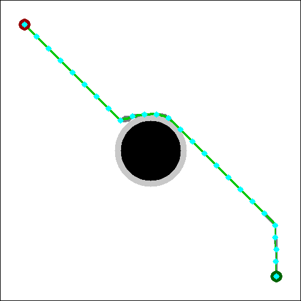
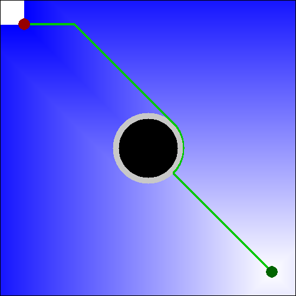

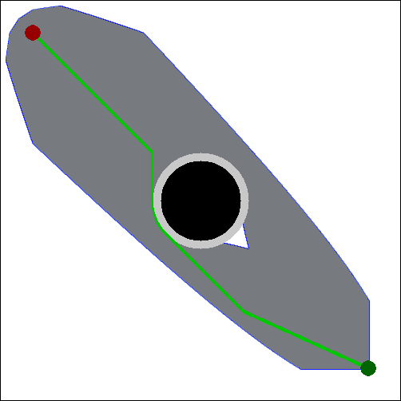
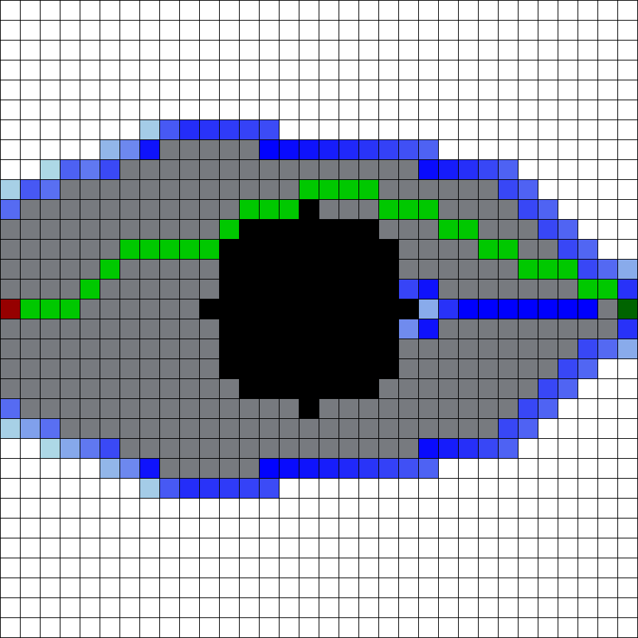

The simulator has a custom GUI that can be used to modify the master launch configuration.

<p class="aligncenter">
    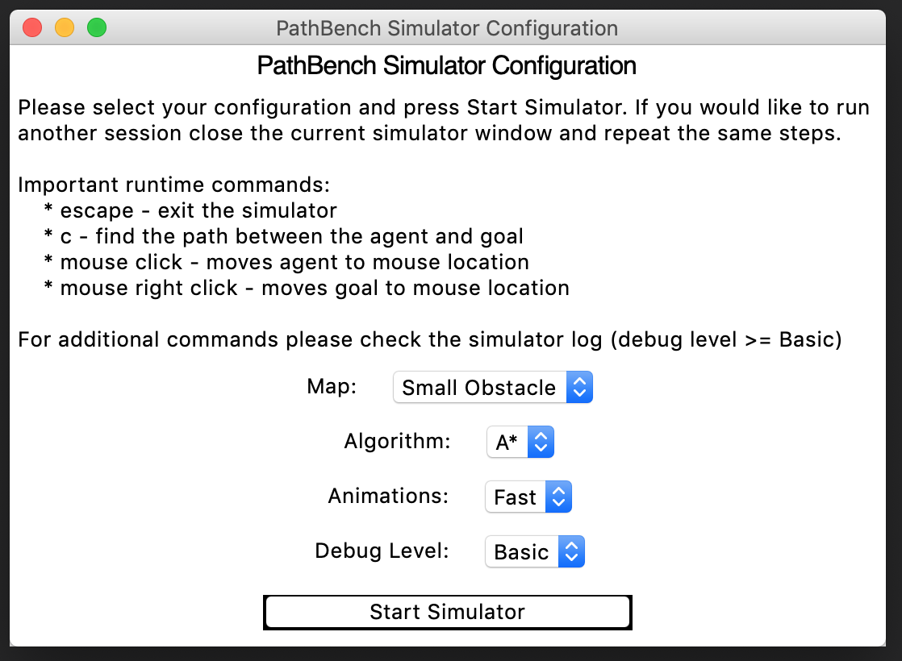
</p>

To run and use the simulator see [Quick Start](#quick-start).

<br />

**Trainer**
This section is responsible for generating and labelling the training data used to train
the Machine Learning models.

**Generator**
This section is a class wrapper over the third party Machine Learning libraries. It
provides a generic training pipeline based on the holdout method and standardised access to the
training data.

**Analyzer**
Analyzer. The final section manages the statistical measures used in the practical assessment of
the algorithms. Custom metrics can be defined as well as graphical displays for visual interpretations.

**ROS Real-time Extension**. The extension provides real-time support for visualisation, coordination
and interaction with a physical robot.

**Example Real Trajectory**
<br />
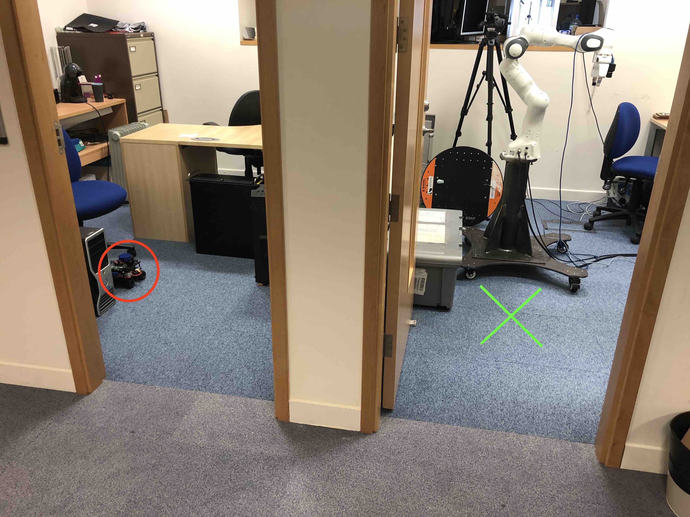

**Trajectory Start**
<br />
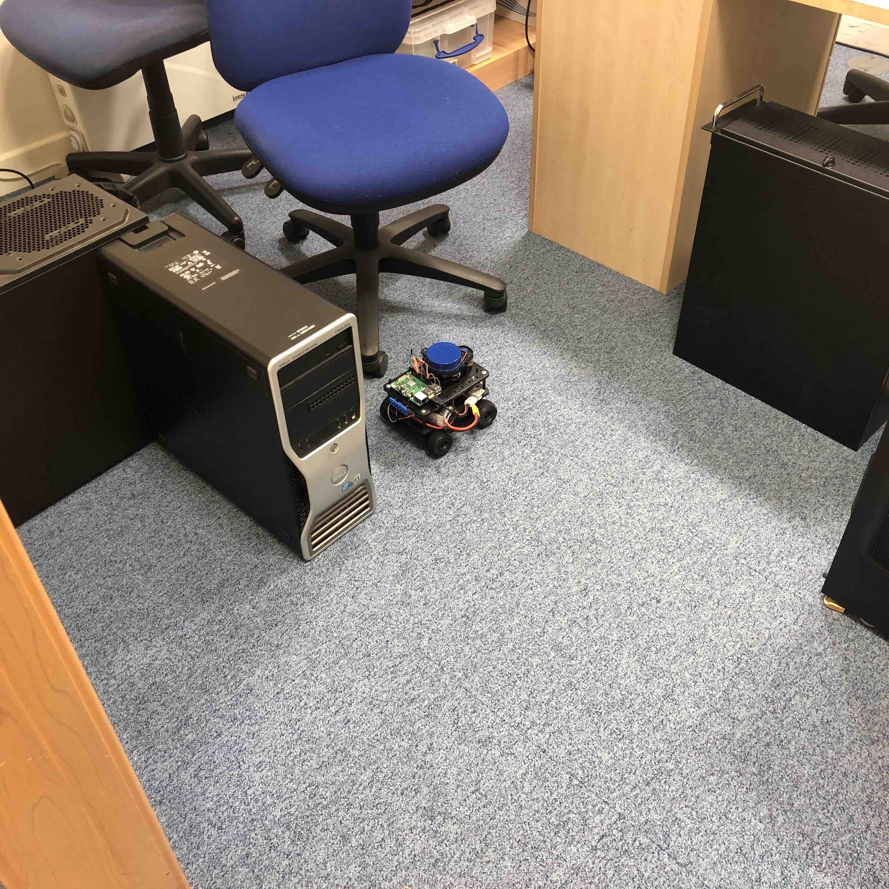
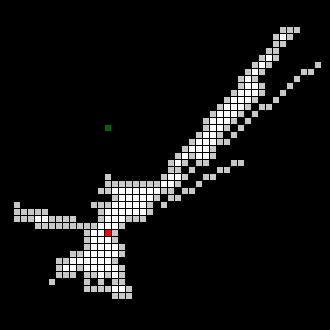
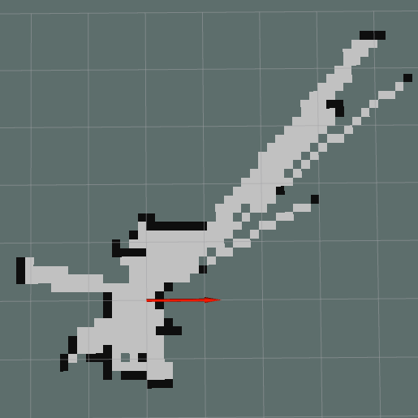

**Trajectory Finish**
<br />
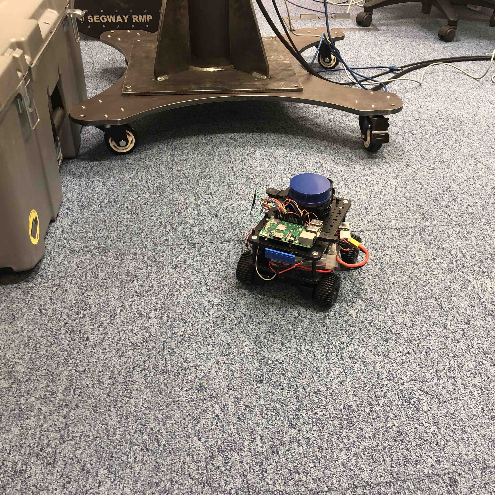
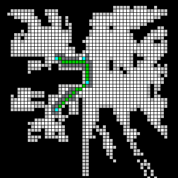
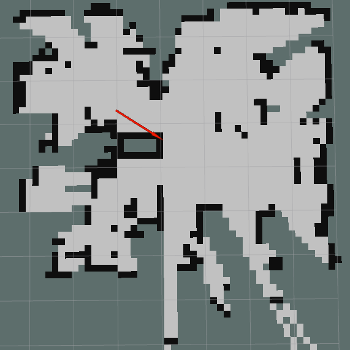

**Architecture High Overiew**


**Platform Architecture**

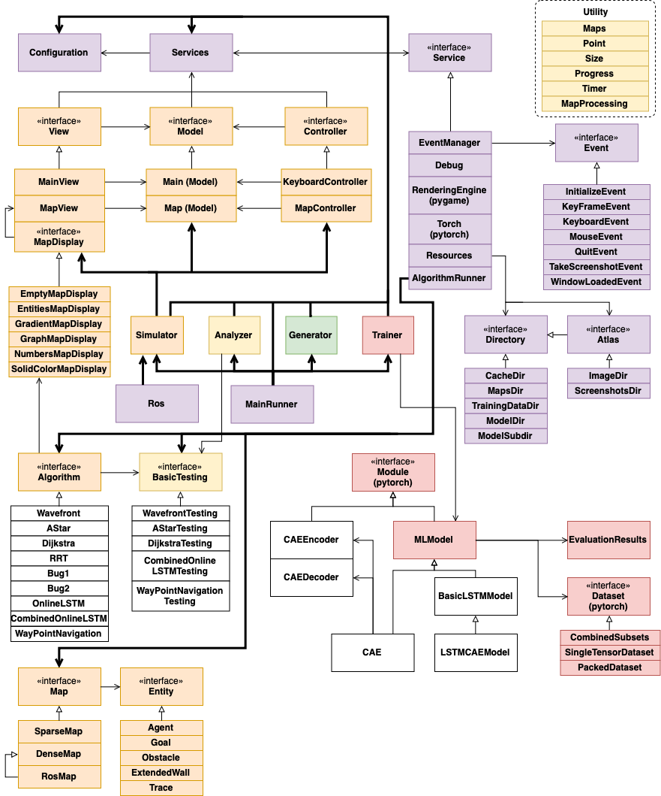

**Infrasturcture**

The MainRunner component is the main entry point of the platform and it coordinates all other
sections. The MainRunner takes a master Configuration component as input which represents
the main inflexion point of the platform. It describes which section (Simulator, Generator,
Trainer, Analyser) should be used and how.

The Services component is a bag of Service components which is injected into all platform classes
in order to maintain global access to the core libraries1. A Service component is created for most
external libraries to encapsulate their APIs and provide useful helper functions2. Moreover, by
making use of the Adapter Pattern we can easily switch third party libraries, if needed, and the
code becomes more test friendly. Finnaly, the Services container can be mocked together with all
its Service components, thus avoiding rendering, file writing and useless printing.

The Simulator was build by following the Model-View-Controller (MVC) pattern. The
Model represents the logic part, the View renders the Model and the Controller handles
the input from the keyboard and mouse, and calls the appropriate functions from the associated
Model. 

The EventManager component is a communication service which allows the Model to
update the View as there is no direct connection between them (from Model to View, the other
way is).

The Debug component is a printing service which augments printing messages with different
decorators such as time-stamp and routes the messages to a specified IO stream or standard out.
It also provides a range of debugging/printing modes: None (no information), Basic (only basic
information), Low (somewhat verbose), Medium (quite verbose), High (all information).
The RenderingEngine component is a wrapper around the pygame library and all rendering is
routed through it.

The Torch service is not an actual wrapper around pytorch, but instead it defines some constants
such as the initial random seed and the training device (CPU/CUDA).

The Resources service is the persistent storage system. It is a container of Directory components
which represent an interface over the actual filesystem directories. It provides safe interaction with
the filesystem and a range of utility directories: Cache (temporary storage used for speeding second
runs), Screenshots, Maps (stores all user defined and generated maps), Images (stores images which
can be converted to internal maps), Algorithms (stores trained machine learning models), Training
Data (stores training data for machine learning models). The main serialisation tool is dill which is
a wrapper around pickle with lambda serialisation capabilities, but custom serialisation is allowed
such as tensor serialisation provided by pytorch or image saving by pygame.

The AlgorithmRunner manages the algorithm session which contains the Algorithm, BasicTesting
and Map. The AlgorithmRunner launches a separate daemon thread that is controlled
by a condition variable. When writing an Algorithm, special key frames can be defined
(e.g. when the trace is produced) to create animations. Key frames release the synchronisation
variable for a brief period and then acquire it again, thus querying new rendering jobs.

The Utilities section provides a series of helper methods and classes: Maps (holds in-memory
user defined Map components), Point, Size, Progress (progress bar), Timer, MapProcessing
(feature extractor used mainly in ML sections).

**Master Load Configuration**

| Configuration Field                            	| Type                             	| Description                                                                                              	|
|------------------------------------------------	|----------------------------------	|----------------------------------------------------------------------------------------------------------	|
| load_simulator                                 	| bool                             	| If the simulator should be loaded                                                                        	|
| clear_cache                                    	| bool                             	| If the cache should be deleted after the simulator is finished                                           	|
| simulator_graphics                             	| bool                             	| If graphics should be used or not; evaluation is always done without graphics                            	|
| simulator_grid_display                         	| bool                             	| The map can be visualised as a plain image or a grid; the window size is defined based on the choice     	|
| simulator_initial_map                          	| Map                              	| The map used in AlgorithmRunner service                                                                  	|
| simulator_algorithm_type                       	| Type[Algorithm]                  	| The algorithm type used in AlgorithmRunner service                                                       	|
| simulator_algorithm_parameters                 	| Tuple[List[Any], Dict[str, Any]] 	| The algorithm parametrs in the form of *args and **kwargs which are used in AlgorithmRunner service      	|
| simulator_testing_type                         	| Type[BasicTesting]               	| The testing type used in AlgorithmRunner service                                                         	|
| simulator_key_frame_speed                      	| int                              	| The refresh rate interval during each key frame; a value of 0 disables the key frames                    	|
| simulator_key_frame_skip                       	| int                              	| How many key frames are skipped at a time; used to speed up the animation when frames per second are low 	|
| simulator_write_debug_level                    	| DebugLevel                       	| The debugging level (None, Basic, Low, Medium, High)                                                     	|
| generator                                      	| bool                             	| If the generator should be loaded                                                                        	|
| generator_gen_type                             	| str                              	| Generation type; can choose between "uniform_random_fill", "block_map" and "house"                       	|
| generator_nr_of_examples                       	| int                              	| How many maps should be generated; 0 does not trigger generation                                         	|
| generator_labelling_atlases                    	| List[str]                        	| Which Map Atlases should be converted to training data                                                   	|
| generator_labelling_features                   	| List[str]                        	| Which sequential features should be extracted for training conversion                                    	|
| generator_labelling_labels                     	| List[str]                        	| Which sequential labels should be extracted for training conversion                                      	|
| generator_single_labelling_features            	| List[str]                        	| Which single features should be extracted for training conversion                                        	|
| generator_single_labelling_labels              	| List[str]                        	| Which single labels should be extracted for training conversion                                          	|
| generator_aug_labelling_features               	| List[str]                        	| Which sequential features should be augmented for training data defined by generator_labelling_atlases   	|
| generator_aug_labelling_labels                 	| List[str]                        	| Which sequential labels should be augmented for training data defined by generator_labelling_atlases     	|
| generator_aug_single_labelling_features        	| List[str]                        	| Which single features should be augmented for training data defined by generator_labelling_atlases       	|
| generator_aug_single_labelling_labels          	| List[str]                        	| Which single labels should be augmented for training data defined by generator_labelling_atlases         	|
| generator_modify                               	| Callable[[Map], Map]             	| Modifies the given map using the custom function                                                         	|
| trainer                                        	| bool                             	| If the trainer should be loaded                                                                          	|
| trainer_model                                  	| Type[MLModel]                    	| The model which will be trained                                                                          	|
| trainer_custom_config                          	| Dict[str, Any]                   	| If a custom configuration should augment the MLModel configuration                                       	|
| trainer_pre_process_data_only                  	| bool                             	| If the trainer should only pre-process data and save it; it does not overwrite cache                     	|
| trainer_bypass_and_replace_pre_processed_cache 	| bool                             	| If pre-processed data cache should be bypassed and re-computed                                           	|


<!-- [Overleaf link](https://www.overleaf.com/project/5c006f75ebc04119dbfb3c90)-->
