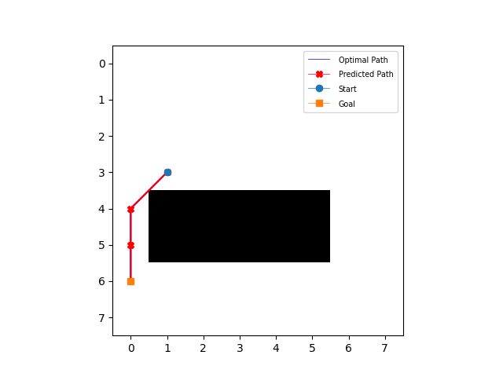
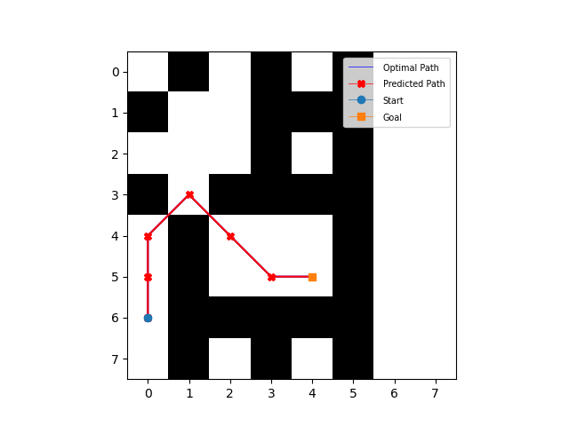
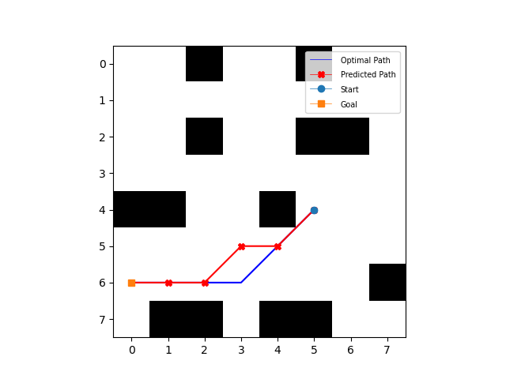

## Introduction

This is a modified implementation of Kent Sommer's PyTorch Value Iteration Networks implementation, meant to work with PathBench. 

Read about Kent Sommers Implementation: [Here](https://github.com/kentsommer/pytorch-value-iteration-networks "Pytorch implementation of Value Iteration Networks")

Read about PathBench: [Here](https://github.com/husseinalijaafar/PathBench "A Benchmarking Platform for Classic and Learned Path Planning Algorithms")

Read the original paper:[Here](https://arxiv.org/abs/1602.02867)

Read about similar implemenations, which have made this modified implemenation possible
* [@kentsommer](https://github.com/kentsommer) ([PyTorch implementation](https://github.com/kentsommer/pytorch-value-iteration-networks))
* [@avivt](https://github.com/avivt) ([Paper Author](https://arxiv.org/abs/1602.02867), [MATLAB implementation](https://github.com/avivt/VIN))
* [@zuoxingdong](https://github.com/zuoxingdong) ([Tensorflow implementation](https://github.com/zuoxingdong/VIN_TensorFlow), [Pytorch implementation](https://github.com/zuoxingdong/VIN_PyTorch_Visdom))
* [@TheAbhiKumar](https://github.com/TheAbhiKumar) ([Tensorflow implementation](https://github.com/TheAbhiKumar/tensorflow-value-iteration-networks))
* [@onlytailei](https://github.com/onlytailei) ([Pytorch implementation](https://github.com/onlytailei/Value-Iteration-Networks-PyTorch))

## What has been modified?
In order to run on PathBench generated maps, I had to modify a few areas of the code. The main difference is within the `test.py` file and `gridworld` class. The maps (resources>maps), which are JSON files structured with the goal position, agent position and grid.
I have also added a few metrics, such as path deviation from optimal path, and time.

The PathBench maps are structured where 0 is obstacle and 1 is free space. 
Sample Map:

## Installation
Instructions:
1. Install Packages
2. Download Training Data
3. Train on Training Data
4. Run `test.py`.

This repository requires following packages:
- [SciPy](https://www.scipy.org/install.html) >= 0.19.0
- [Python](https://www.python.org/) >= 2.7 (if using Python 3.x: python3-tk should be installed)
- [Numpy](https://pypi.python.org/pypi/numpy) >= 1.12.1
- [Matplotlib](https://matplotlib.org/users/installing.html) >= 2.0.0
- [PyTorch](http://pytorch.org/) >= 0.1.11

Use `pip` to install the necessary dependencies:
```
pip install -U -r requirements.txt 
```
Note that PyTorch cannot be installed directly from PyPI; refer to http://pytorch.org/ for custom installation instructions specific to your needs. 

#### Downloading Training Data
WIP 

To aquire the training data (NOT for PathBench Maps), either run the training data generator `make_training_data.py` in the dataset folder (resource intensive), or run the shell script to download them:
1. `cd` into main directory
2. `chmod +x download_weights_and_datasets.sh`
3. `./download_weights_and_datasets`

It should download the training data. 
#### PathBench Training Data

*Outdated- Please await updated training files*

To download PathBench training data, visit [GDrive](https://drive.google.com/file/d/11D-QCf5qZ4qusv66XhxOqqdcyHl5RLHk/view?usp=sharing)
Currently, only the 90000 map training data is uploaded. I will upload more as I generate them. 

To generate your own training data, add the json files with correct structure to a specified path, and pass that path in the `make_training_data.py` file. It is fairly straight forward. 

## How to train
#### 8x8 gridworld
```bash
python train.py --datafile dataset/gridworld_8x8.npz --imsize 8 --lr 0.005 --epochs 30 --k 10 --batch_size 128
```
#### 16x16 gridworld
```bash
python train.py --datafile dataset/gridworld_16x16.npz --imsize 16 --lr 0.002 --epochs 30 --k 20 --batch_size 128
```
#### 28x28 gridworld
```bash
python train.py --datafile dataset/gridworld_28x28.npz --imsize 28 --lr 0.002 --epochs 30 --k 36 --batch_size 128
```
**Flags**: 
- `datafile`: The path to the data files.
- `imsize`: The size of input images. One of: [8, 16, 28]
- `lr`: Learning rate with RMSProp optimizer. Recommended: [0.01, 0.005, 0.002, 0.001]
- `epochs`: Number of epochs to train. Default: 30
- `k`: Number of Value Iterations. Recommended: [10 for 8x8, 20 for 16x16, 36 for 28x28]
- `l_i`: Number of channels in input layer. Default: 2, i.e. obstacles image and goal image.
- `l_h`: Number of channels in first convolutional layer. Default: 150, described in paper.
- `l_q`: Number of channels in q layer (~actions) in VI-module. Default: 10, described in paper.
- `batch_size`: Batch size. Default: 128

## How to test / visualize paths (requires training first)
#### 8x8 gridworld
```bash
python test.py --weights trained/vin_8x8.pth --imsize 8 --k 10
```
#### 16x16 gridworld
```bash
python test.py --weights trained/vin_16x16.pth --imsize 16 --k 20
```
#### 28x28 gridworld
```bash
python test.py --weights trained/vin_28x28.pth --imsize 28 --k 36
```
#### 64x64 gridworld
```bash
python test.py --weights trained/vin_28x28.pth --imsize 28 --k 36
```
(64x64 still uses 28x28 trained data, we haven't trained VIN on 64x64 maps yet.)

To visualize the optimal and predicted paths simply pass:
```bash 
--plot
```

**Flags**: 
- `weights`: Path to trained weights.
- `imsize`: The size of input images. One of: [8, 16, 28]
- `plot`: If supplied, the optimal and predicted paths will be plotted 
- `k`: Number of Value Iterations. Recommended: [10 for 8x8, 20 for 16x16, 36 for 28x28]
- `l_i`: Number of channels in input layer. Default: 2, i.e. obstacles image and goal image.
- `l_h`: Number of channels in first convolutional layer. Default: 150, described in paper.
- `l_q`: Number of channels in q layer (~actions) in VI-module. Default: 10, described in paper.

## Results
The maps that VIN trains on are NOT the PathBench maps, rather they are maps generated from Kent's implementation. This is still WIP 
Therefore, when running VIN w/ PathBench maps, it is running on untrained style maps (Block map and Uniform Random Fill are unfamiliar to 
the algorithm). 

Logs are saved in `resources>logs`. You can change the logging behaviour (debug vs info) in `test_pb.py`. Ensure logs don't overwrite eachother by changing the name at each run. 

### Sample Maps: 
Block Map:

  

Uniform Random Fill Map


House Map



### Training
WIP


